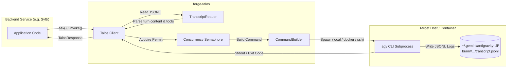

# Talos — Agentic CLI Invocation for The Forge

[](https://crates.io)
[](https://docs.rs)
[](LICENSE)
[]()

> **Talos** (`forge-talos`) is an async Rust library for invoking the Google Antigravity `agy` CLI as a subprocess, automatically capturing output, managing execution concurrency, and parsing structured transcripts into clean Rust types.

---

## 🏛️ Mythological Origins

In Greek mythology, **Talos** (Τάλως) was a giant bronze automaton crafted by Hephaestus to guard the island of Crete. He patrolled the island three times a day, warding off invaders and protecting the realm with unwavering vigil.

In **The Forge** ecosystem, **Talos** fulfills the same guardian role: serving as the lightweight, dependable sentinel that shields applications from raw CLI process management, executing agentic tasks via `agy`, and delivering structured results to downstream services.

---

## 💡 Why Talos Exists

Modern backend microservices and domain applications across **The Forge** need agentic capabilities (reasoning, code analysis, document processing, email classification) powered by Google Antigravity (`agy`).

However, operating a full agent gateway like **Ganymede** introduces significant operational overhead:
* Persistent websockets, PTY injection, and complex session routing.
* Inter-agent messaging protocols and gateway telemetry dependencies.

**Talos** bridges this gap for standalone services:
1. **Lightweight & Direct**: Spawns `agy` directly as a subprocess (`local`, `docker`, or `ssh`).
2. **Zero Gateway Overhead**: Services invoke agents with simple Rust function calls (`talos.ask(...)`).
3. **Structured Transcript Extraction**: Automatically reads JSONL transcripts written by `agy` to extract rich metadata (tool calls, generated artifacts, duration) without scraping stdout.
4. **Safe Process Scoping & Concurrency**: Built-in semaphore limits and timeouts prevent process runaway or API exhaustion.

---

## 📐 Architecture



---

## 🚀 Quick Start

Add `forge-talos` to your `Cargo.toml`:

```toml
[dependencies]
forge-talos = "0.1.0"
tokio = { version = "1", features = ["full"] }
tokio-stream = "0.1"
```

### 1. Simple One-Shot Query (`ask`)

```rust,no_run
use forge_talos::{Talos, Result};

#[tokio::main]
async fn main() -> Result<()> {
    // Auto-discover talos.toml or fall back to defaults
    let talos = Talos::discover().await?;

    let answer = talos.ask("Summarize the benefits of async I/O in Rust in one sentence.").await?;
    println!("Response: {answer}");

    Ok(())
}
```

### 2. Structured Invocations (`invoke`)

For explicit model selection, custom timeouts, and environmental overrides:

```rust,no_run
use forge_talos::{Talos, TalosRequest, Model, Result};

#[tokio::main]
async fn main() -> Result<()> {
    let talos = Talos::discover().await?;

    let req = TalosRequest::new("Extract key action items from the meeting transcript.")
        .with_model(Model::GeminiPro)
        .with_project("/path/to/project")
        .with_timeout(180)
        .with_env("ENVIRONMENT", "production");

    let response = talos.invoke(req).await?;

    println!("Text Output:\n{}", response.text);
    println!("Conversation ID: {}", response.conversation_id);
    println!("Duration: {:?}", response.duration);
    println!("Tool Calls: {:?}", response.tool_calls);
    println!("Artifacts Produced: {:?}", response.artifacts);

    Ok(())
}
```

---

## 🌊 Streaming Output

`TalosStream` allows consuming agent output line-by-line in real time as the `agy` process executes.

```rust,no_run
use tokio_stream::StreamExt;
use forge_talos::{Talos, TalosRequest, Model, TalosEvent, Result};

#[tokio::main]
async fn main() -> Result<()> {
    let talos = Talos::discover().await?;

    let req = TalosRequest::new("Write a Rust function to parse semver strings.")
        .with_model(Model::GeminiFlash);

    let mut stream = talos.invoke_stream(req).await?;

    while let Some(event) = stream.next().await {
        match event {
            TalosEvent::TextChunk(chunk) => {
                println!("[stdout] {chunk}");
            }
            TalosEvent::Complete(response) => {
                println!("\n✓ Task complete in {:?}", response.duration);
                println!("Conversation ID: {}", response.conversation_id);
            }
            TalosEvent::Error(err) => {
                eprintln!("❌ Execution error: {err}");
            }
        }
    }

    Ok(())
}
```

---

## ⚙️ Configuration (`talos.toml`)

Talos automatically searches for a `talos.toml` configuration file in the following order:
1. `./talos.toml` (Current working directory)
2. `$HOME/.config/talos/talos.toml`
3. `/etc/talos/talos.toml`

If no configuration file is present, sensible defaults are applied.

### Complete `talos.toml` Reference

```toml
[agy]
# Execution mode: "local", "docker", or "ssh"
mode = "local"

# Path to the agy binary (defaults to "agy" on $PATH)
binary_path = "agy"

# Required if mode = "docker"
# container = "hephaestus-agent-runner"

# Required if mode = "ssh"
# host = "dionysus.mesh.internal"
# user = "forge"

[defaults]
# Model flag passed to agy (--model)
model = "gemini-flash-agent"

# Print timeout in seconds (--print-timeout)
timeout_secs = 300

# Optional directory containing custom skill TOML files
# skills_dir = "/etc/talos/skills"

# Optional override for agy data directory (defaults to ~/.gemini/antigravity-cli)
# data_dir = "/var/lib/antigravity"

[limits]
# Maximum concurrent process invocations (guarded by semaphore)
max_concurrent = 4

# Maximum prompt payload size in bytes (defaults to 1 MiB)
max_prompt_bytes = 1048576
```

### Execution Modes Explained

| Mode | Description | Example Command Executed |
| :--- | :--- | :--- |
| **`local`** | Executes `agy` directly on the local machine. | `agy --print "..." --model gemini-flash-agent` |
| **`docker`** | Executes `agy` inside a running Docker container via `docker exec`. | `docker exec <container> agy --print "..."` |
| **`ssh`** | Executes `agy` on a remote VPS/host over SSH transport. | `ssh user@host agy --print "..."` |

---

## 📖 API Reference

### Core Structs & Enums

#### `Talos`
Main entry point for process orchestration. Thread-safe and cheaply cloneable (`Arc`-backed).
- `Talos::discover().await -> Result<Talos>`: Discovers `talos.toml` and initializes client.
- `Talos::from_config(path).await -> Result<Talos>`: Initializes client from custom config file path.
- `Talos::with_defaults() -> Talos`: Initializes client using default settings.
- `talos.ask(&str).await -> Result<String>`: Convenient one-shot prompt invocation.
- `talos.ask_with(&str, Model).await -> Result<String>`: One-shot prompt invocation specifying model.
- `talos.invoke(TalosRequest).await -> Result<TalosResponse>`: Executes full request lifecycle.
- `talos.invoke_stream(TalosRequest).await -> Result<TalosStream>`: Returns async event stream.

#### `TalosRequest`
Builder for configuring individual process invocations.
- `TalosRequest::new(prompt)`: Create request with prompt string.
- `.with_model(Model)`: Set model target.
- `.with_project(path)`: Pass `--project` path.
- `.with_timeout(seconds)`: Override timeout in seconds.
- `.with_env(key, val)`: Add environment variable forwarded via `--env`.

#### `TalosResponse`
Structured result parsed from process output and JSONL transcript.
- `text: String`: Assistant text output.
- `conversation_id: String`: Unique session ID assigned by `agy`.
- `tool_calls: Vec<serde_json::Value>`: Array of tool calls made during the turn.
- `artifacts: Vec<String>`: File paths of generated artifacts.
- `duration: std::time::Duration`: Total execution wall-clock time.

#### `Model`
Enum representing supported Gemini model variants:
- `Model::GeminiFlash` (`gemini-flash-agent`): Fast, balanced default choice.
- `Model::GeminiPro` (`gemini-pro-agent`): High reasoning capability, slower execution.
- `Model::GeminiFlashLite` (`gemini-flash-lite-agent`): High-throughput, lightweight model.

#### `TalosEvent`
Yielded by `TalosStream`:
- `TalosEvent::TextChunk(String)`: Live stdout line.
- `TalosEvent::Complete(TalosResponse)`: Final process completion event.
- `TalosEvent::Error(String)`: Execution or parsing error.

#### `TalosError`
Comprehensive error type built with `thiserror`:
- `AgyNotFound`: `agy` binary not present on system PATH or configured location.
- `Timeout`: Invocation exceeded configured maximum time limit.
- `ProcessFailed { exit_code, stderr }`: Non-zero exit code returned by `agy`.
- `TranscriptNotFound { path }`: Transcript file missing after process exit.
- `ParseError(String)`: Error parsing JSONL transcript or stdout.
- `ConcurrencyLimit`: Maximum allowed concurrent tasks reached.
- `ConfigError(String)`: Invalid configuration parameters.
- `IoError(std::io::Error)`: Low-level I/O failure.

---

## 🛠️ Real-World Integration Example: Syftr

**Syftr** is an automated email ingestion and processing engine within The Forge architecture. Syftr uses `forge-talos` to classify incoming emails and extract key data:

```rust,no_run
use forge_talos::{Talos, TalosRequest, Model, Result};
use serde::Deserialize;

#[derive(Deserialize, Debug)]
pub struct EmailClassification {
    pub category: String,
    pub priority: String,
    pub action_required: bool,
}

pub struct EmailProcessor {
    talos: Talos,
}

impl EmailProcessor {
    pub async fn new() -> Result<Self> {
        Ok(Self {
            talos: Talos::discover().await?,
        })
    }

    pub async fn classify(&self, sender: &str, subject: &str, body: &str) -> Result<EmailClassification> {
        let prompt = format!(
            "Analyze this email and respond ONLY with JSON containing 'category', 'priority', and 'action_required':\n\
             From: {sender}\nSubject: {subject}\nBody: {body}"
        );

        let req = TalosRequest::new(prompt)
            .with_model(Model::GeminiFlash)
            .with_timeout(30);

        let resp = self.talos.invoke(req).await?;
        let classification: EmailClassification = serde_json::from_str(&resp.text)?;
        Ok(classification)
    }
}
```

---

## 🌐 Reusability Across The Forge

`forge-talos` is engineered as a general-purpose, reusable building block across The Forge ecosystem:

* 🤖 **`agents.dforge.ca`**: Autonomous agent microservices requiring CLI agent invocation without gateway coupling.
* 🧠 **`minerva`**: Knowledge base & semantic document indexing backend.
* ⚡ **`zkesg.com` Bots**: Automated compliance & audit analysis bots running scheduled LLM extraction jobs.
* 🛠️ **Forge Tooling & CI/CD**: Build scripts and deployment health validators.

---

## 📄 License

Distributed under the MIT License. See [`LICENSE`](LICENSE) for more information.

Copyright (c) 2026 **Digital Forge Canada**
